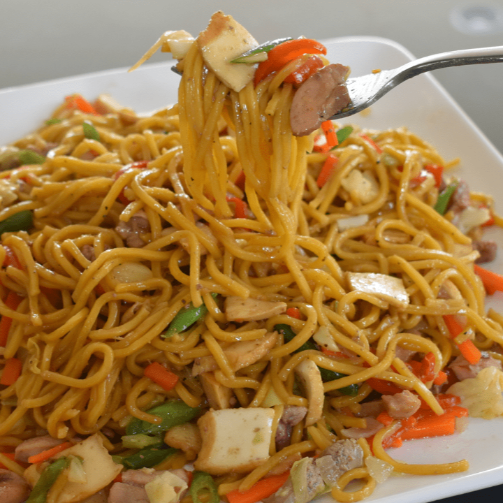

<html>
    
    <head>
        <link rel="preconnect" href="https://fonts.googleapis.com">
        <link rel="preconnect" href="https://fonts.gstatic.com" crossorigin>
        <link href="https://fonts.googleapis.com/css2?family=Madimi+One&family=Montserrat:ital,wght@1,600&display=swap" rel="stylesheet">

        <title>Test</title>
        

        <body>
            
            <video autoplay muted loop id = "myVideo">
                <source src="marketPlace.mp4" type="video/mp4">
                Your browser does not support HTML5 video.
              </video>

            

                

                    

                        <b id = "title">
                            MY Top 10 Favorite Foods
    
                        </b>
                      
                    

                    

                        <a href = "https://en.wikipedia.org/wiki/Fried_chicken"  target="_blank">
                            

                                 
                                
                                

                                    FRIED CHICKEN
                                      
                                    Dish of chicken cooked until brown                        
                                

                            

                        </a>
                        
                        <a href = "https://en.wikipedia.org/wiki/Philippine_adobo" target = "_blank">
                            

                            
                                 
                                
                                

                                    CHICKEN ADOBO
                                      
                                    Unofficial national dish of the Philippines
                                

                            

                        </a>
    
                        
                        <a href = "https://en.wikipedia.org/wiki/Peanut_butter" target = "_blank">
                            

                            
                                 
                                
                                

                                    PB SANDWICH
                                      
                                    Versatile food of peanut butter spread on bread
                                

                            

                        </a>
                        
                        <a href = "https://en.wikipedia.org/wiki/Tempura" target = "_blank">
                            

                                 
                                
                                

                                    TEMPURA 
                                      
                                    Japanese dish coated shrimp
                                

                            

                        </a>
                        
                        <a href = "https://tl.wikipedia.org/wiki/Kalamares" target = "_blank">
                            

                                 
                                
                                

                                    CALAMARES 
                                      
                                    Deep-fried squid rings
                                

                            

                        </a>
   
                        <a href = "https://en.wikipedia.org/wiki/Onion_ring" target = "_blank">
                            

                                 
                                
                                

                                    ONION RINGS
                                      
                                    Crispy fried rings of onions
                                

                            

                        </a>

                        <a href = "https://en.wikipedia.org/wiki/Sushi" target = "_blank">
                            

                                 
                                
                                

                                    SUSHI 
                                      
                                    Japanese dish of rolled vinegared rice
                                

                            

                        </a>
    
                        
                        <a href = "https://en.wikipedia.org/wiki/Pizza" target = "_blank">
                            

                                 
                                
                                

                                    PIZZA 
                                      
                                    Italian dish of baked doughy crust
                                

                            

                        </a>
                        
                        <a href = "https://en.wikipedia.org/wiki/Chicken_inasal" target = "_blank">
                            

                                 
                                
                                

                                    CHICKEN INASAL
                                      
                                    Marinated chicken grilled to smoky perfection
                                

                            

                        </a>
    
                        <a href = "https://en.wikipedia.org/wiki/Pancit" target ="_blank">
                            

                                 
                                
                                

                                    PANCIT CANTON
                                      
                                    Filipino stir-fry dish symbol of long life
                                

                            

                        </a>
    
                        
    
                        
                    

                

            

            
            
        </body>
    </head>

</html>
